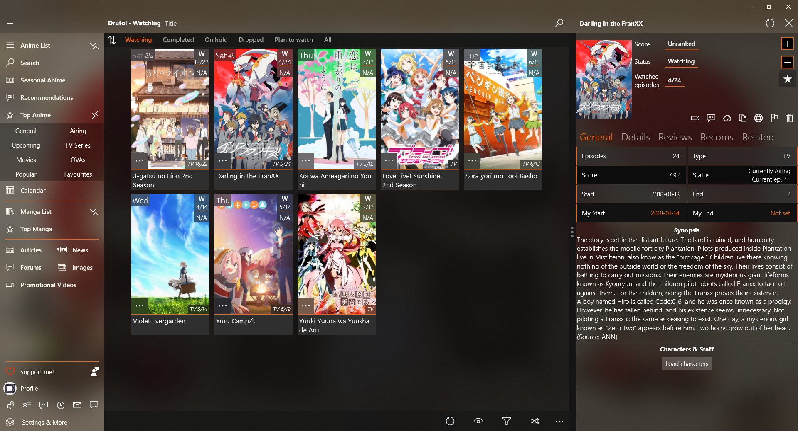
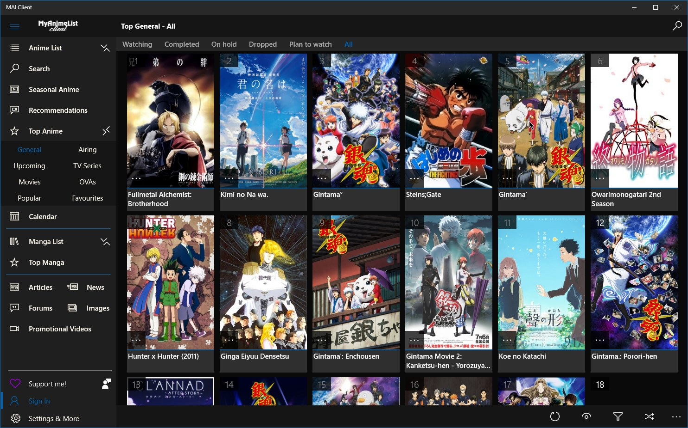
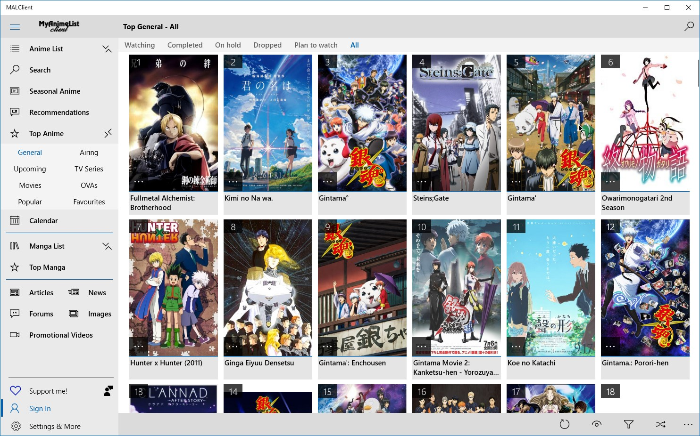
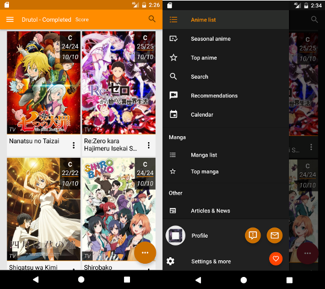

# MALClient
<p align="center">
  
  <br>
  It's rather robust MyAnimeList client application interfacing with both "official" api and the website api with wild endpoints with cookies and such. Right now it's available on Windows 10 devices and Android version coming really soon.
</p>

<table >
  <tbody>
    <tr>
      <td>
        <a href="https://www.microsoft.com/store/apps/9nblggh5f3bl?ocid=badge">
          
        </a>
      </td>
      <td>
        <a href='https://play.google.com/store/apps/details?id=com.drutol.malclient&pcampaignid=MKT-Other-global-all-co-prtnr-py-PartBadge-Mar2515-1'>
          
        </a>
      </td>
    </tr>
  </tbody>
</table>

### Screenshots
#### UWP
<p align="center">
  
</p>

#### UWP Dark Theme
<p align="center">
  
</p>

#### UWP Light Theme
<p align="center">
  
</p>

#### Android
<p align="center">
  
</p>

### Features
* Anime and manga list updates.
  * Score,Status,Episodes,Volumes
  * Tags
  * Favourites
  * Start/End date
  * Rewatching
* Anime list with sorting, filters.
  * Grid view
  * Compact view
  * Detailed grid view
* Anime info.
  * Genres
  * Episodes
  * Reviews
  * Recommendations
  * Personalized anime/manga suggestions.
  * Related
  * Characters&Staff
  * Mal statisctics
  * Promotional videos
* Top anime/manga.
  * With multiple categories
* Seasonal anime
  * With multiple season selection
* Anime by studio and genre
* Global anime&manga recommendations
* Calendar
  * With countdowns to nex episode
* Mal articles
  * Mal news
* Live tiles
* Mal messaging 
* Tons of settings
* Mal profile
  * With navigation accross others' profiles
  * Profile comments, you can add new ones too!
  * Profile comment converstion
* Forums
  * As native as it's possible, not wrapped website.
* System toasts/notifications and notification hub!
* Friends feeds parsed from rss channels.
* History.
* And much more!

### Compilation
You should be able to compile this thing out of the box, you may have to generate certificate for UWP though.
### Code
Well... there's a metric ton of legacy thingies especially in navigation and first pages like anime list or anime details. I'm not proud of these but I'm not planning to rewrite them. Stuff that has been added later on is nicer and somewhat decently organised. I started this app when I knew nothing so yeah, works but code is smelly.
### "Protocol"

If you'd like for some reason to launch my app externally you can do so by using this protocol:
```
malclient://<your everyday MAL link>
```
List of all accepted urls can be found [here](https://github.com/Drutol/MALClient/blob/714a73a3f4389a3212843fda243c1034c7347144/MALClient.XShared/Utils/MalLinkParser.cs)

### Donations

Well, if you really like my app I won't stop you:

[](https://www.paypal.me/drutol)
